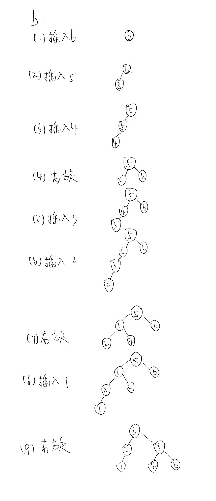

# **Questions**

## 1.

顺序查找平均比较次数 = $\frac{(1+2+...+1000,000)\times1000,000}{2\times1000,000} \approx 500,000$

折半查找平均比较次数 = $\log_2 1000,1000 \approx 20$

所以折半查找比顺序查找平均快 $\frac{500,000}{20} \approx 25,000$倍

---

## 2.

初始状态：船、男孩A、B和士兵都在一侧。

对于每一个士兵：男孩A、B一起驾船到对岸，A下船，B将船开回，一个士兵开船到对岸下船，A开船回来，恢复初始状态。该过程需横渡4次。

总计：4N次

---

## 3.

a. 前序法：abdecf

b. 中序法：dbeacf

c. 后序法：debfca

---

## 4.

---

## 5.

设丈夫为$A_1$, $A_2$, ..., $A_n$，妻子为$B_1$, $B_2$, ..., $B_n$。

通用算法：
1. 取同一对夫妻$A_n$和$B_n$过河
2. 妻子$B_n$回去
3. 妻子$B_n$和另一对夫妻中的妻子$B_{n+1}$过河
4. 妻子$B_{n+1}$回去
5. 以上4步完成后，同一对夫妻$A_n$和$B_n$过河，其他人和船位置不变。重复1-4，直到所有夫妻都过河。

a. 
1. $A_1$和$B_1$过河；
2. $A_1$留在对岸，$B_1$驾船回去；
3. $B_1$和$B_2$过河；
4. $B_2$驾船回去；
5. $A_2$和$B_2$过河。

船需要横渡5次。

b. 
1. $A_1$和$B_1$过河；
2. $A_1$留在对岸，$B_1$驾船回去；
3. $B_1$和$B_2$过河；
4. $B_2$驾船回去；
5. $A_2$和$B_2$过河；
6. $A_2$留在对岸，$B_2$驾船回去；
7. $B_2$和$B_3$过河；
8. $B_3$驾船回去；
9. $A_3$和$B_3$过河；

船需要横渡9次。

c. 

根据以上算法对任意正整数n都成立，问题有解。

船需要横渡4(n-1)+1次。

---

# Programming

## 运行结果

## 函数代码

## 算法思路

根据矩阵性质，假设查看矩阵中心那个元素，与目标值比较。如果目标值更大，则可以排除该元素上方半列、左边半行的值，以及它们围成的四分之一矩阵中的所有元素。同理，如果目标值更小，则可以排除该元素下方半列、右边半行的值，以及它们围成的四分之一矩阵中的所有元素。

排除思路：

- 因为矩阵不一定是方阵，无法在主对角线上采用类似二分查找的算法：找到离目标值最近并分别比它更大/更小的两个元素，排除两者左上角、右下角两个子矩阵。
- 如果采用递归算法，但每次只排除四分之一个子矩阵，在另外三个子矩阵递归查找，则可以容易估计出此法空间开销太大：每次递归都需要存子矩阵的坐标（用左上角、右下角两个点的坐标，即两个整数对构成），而且每次阐述3个子递归，在矩阵尺寸大时消耗内存很大，过多的递归调用消耗时间也很多。此外，此法实现比较复杂。

采用思路：

- 利用上述“可以排除该元素上方半列、左边半行的值”这一性质，通过首次查看最右上角（最左下角同理）元素，每次循环排除一整列或一整行，具体描述如下：
  1. 当目标值大于查看元素，要查看的元素下移一行；
  2. 当目标值小于查看元素，要查看的元素左移一列；
  3. 重复以上步骤，直到找到元素（返回true），或超出矩阵范围（返回false）。

时间复杂度：$O(m+n)$，其中m和n分别为矩阵的行数、列数

空间复杂度：$O(1)$。

