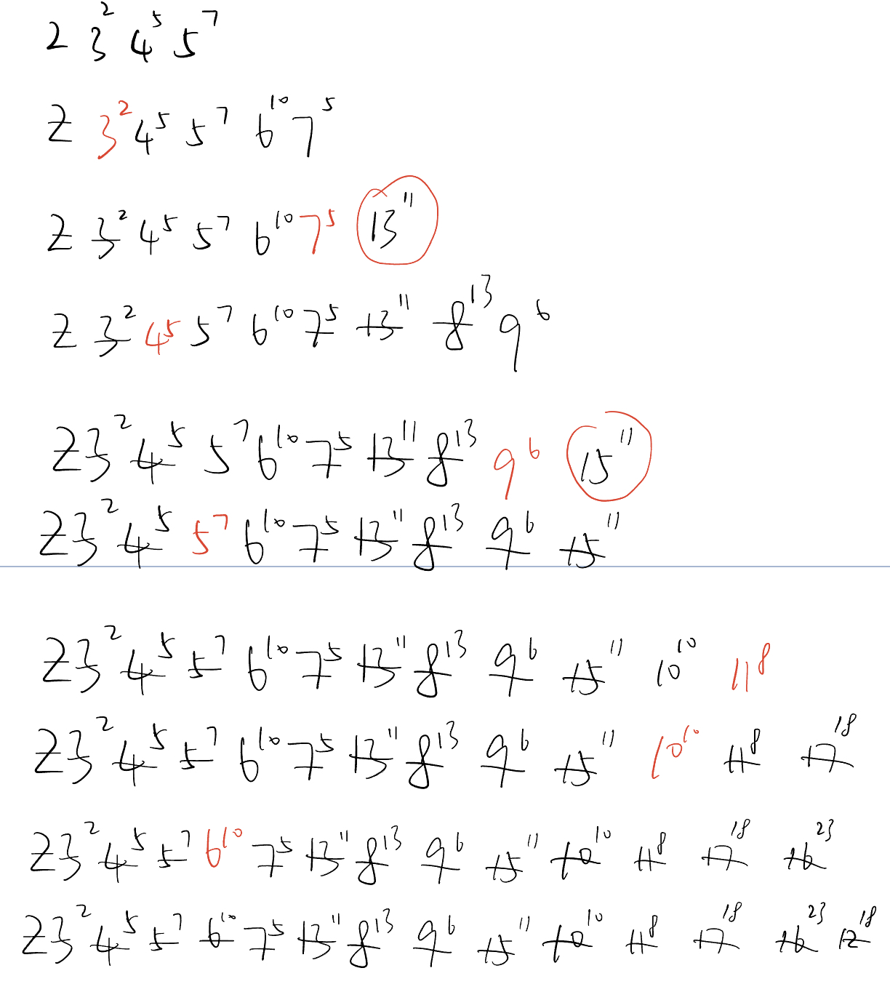

## 计算题


### 1.

解空间树：


搜索过程：

- a-b-d-f-c-(回溯到f)
- f-g-e(回溯到g-f-d)
- d-g-e(回溯到g)
- g-f-c(回溯到f-g-d-b)
- b-e-g-d-f-c-a(成功求到一个解)

结果：a-b-e-g-d-f-c-a


### 2.

定义状态转移方程：


设$f(n)$表示组成面额为$n$时所需最少硬币总数量，初始$f(0)=0$。

$g(n)$表示组成面额为$n$时3种硬币各需要几个，初始$g(0)=(0,0,0)$

则：$f(n)=min\{f(n-1),f(n-3),f(n-5)\}+1$

若$f(n-1)$最小，则$g(n)=g(n-1)+(1,0,0)$;

若$f(n-3)$最小，则$g(n)=g(n-3)+(0,1,0)$;

若$f(n-5)$最小，则$g(n)=g(n-5)+(0,0,1)$。

$g(n)$可以有多个值。


根据上面的初始化和递推规则，填完下面的表：

| n      | 0         | 1         | 2         | 3         | 4         | 5         | 6                 | 7                 | 8         | 9                 |
| ------ | --------- | --------- | --------- | --------- | --------- | --------- | ----------------- | ----------------- | --------- | ----------------- |
| $f(n)$ | 0         | 1         | 2         | 1         | 2         | 1         | 2                 | 3                 | 2         | 3                 |
| $g(n)$ | $(0,0,0)$ | $(1,0,0)$ | $(2,0,0)$ | $(0,1,0)$ | $(1,1,0)$ | $(0,0,1)$ | $(1,0,1),(0,2,0)$ | $(2,0,1),(1,2,0)$ | $(0,1,1)$ | $(1,1,1),(0,3,0)$ |

得到最少硬币数为3，可能的组合为：

- $1\times1,3\times1,5\times1$

  

- $3\times3$

算法伪代码：

```python
def findCoinNum(n):
	# 初始化表格
  table[0][0]=0
  table[1][0]=(0,0,0)
  
  for i in range(1, n + 1):
  
  	找出所有具有最小f值f_min的n值, min_f_n = [n_0, n_1, n_2, ...]
  
  	# 更新f(n)
  	table[0][i] = f_min + 1
    
    # 更新g(n)
  	for m in min_f_n:
    	if m == 1:
        table[1][i].append(table[1][m] + (1,0,0))
      elif m == 3:
        table[1][i].append(table[1][m] + (0,1,0))
      elif m == 5:
        table[1][i].append(table[1][m] + (0,0,1))
        
	# 返回结果
  return table[0][n],table[1][n]
```


### 3.

解空间树：


搜索过程：


结果：

选择物体2、3，总价值119。


### 4.

解空间树：


优先队列式分支线接法搜索过程：（利用了极小堆剪枝）



结果：

选择物体2、3，总价值119。


### 5. 

思路：

1. 根据等边三角形旋转对称性，状态空间中很多可以通过旋转、镜像相互转换，这些同构状态下要么都有解、要么都无解
2. 剪枝函数为判断当前状态是否有解。因初始为14个棒，若有解必然13步后结束，因此不能用最短步数剪枝。通过查询当前状态是否与之前记录过的一个无解状态同构，判断是否剪枝。

伪代码：

```python
# 数据结构定义
棋盘状态s：二维数组
最初空孔位置pos：二元组
无解状态集合terminal：链表
步骤steps：栈
结果results：链表

# 初始化
初始化上述数据结构
将初始状态s_0放入栈steps

while steps不为空:
  取出栈顶元素s
  
  # 得到一个解
  if 状态s只剩一个棒:
    # 对于问题a，直接得到结果
    将整个栈steps复制并链入结果链表results
    
    # 对于问题b，需判断最后的棒是否在最初空孔上
    if 最后的棒的位置 == 最初空孔位置pos:
      将整个栈steps复制并链入结果链表results
  
  else:
    # 得到一个无解状态
  	if 状态s已经无法进行跳跃：
    	将整个栈steps复制并链入无解状态集合链表terminal
      
    # 当前状态既非无解、也非结果，则记录其子节点
    else:
      # 通过遍历状态里的每个棒子，判定其是否可以跳跃来得到子节点
      for elem in s:
        if 棒子elem可以跳跃:
          s_ = elem跳跃后得到的状态
          children.append(s_)
          
          # 若子节点s_不是无解状态，则加入栈
          if s_不与无解状态集合terminal中的任何状态同构:
            steps.append(s_)
          
      
```


## 编程题

## 算法思路


1. 数据结构
   - 已访问格子visited：bool型二维数组，初始化为全false
   - 起始格子starts：记录所有可能的起点的数组，初始化为所有grid的非0点坐标
   - 步骤栈steps：记录探索过程中的步骤的栈，初始化为空
   - 路径数组path：记录到当前终点的路径的数组，初始化为空
   - 分岔点坐标数组forks：记录当前路径上所有需要回溯到的分岔点
   - 分岔点分岔数数组fork_count：记录对应位置的分岔点还有多少个其他分岔路径需要回溯探索
2. 辅助函数
   - 给定一个坐标，求其上下左右四个邻居是否有未经过、且黄金数不为0的格子
   - 返回该坐标下一步可以走的格子构成的数组
3. 对starts中的每个起点，先重置数据结构，起点加入steps后，执行以下循环，直到steps为空：
   - 取出栈顶格子，标记为已经过，加入当前路径path，然后通过辅助函数求其下一步可以走的格子
   - 如果该格子有下一步，则将所有下一步压入栈steps
     - 如果该格子有多个下一步，则是分岔点，压入分岔点数组forks
   - 如果没有下一步，说明当前路径走到了尽头
     - 根据path计算当前路径上的黄金总数，更新最大黄金数
     - 回退路径栈path
       - 如果不是分岔点或分岔点的分岔数为0，则回退该格子
       - 如果是分岔点且分岔数不为0，则回退到该分岔点继续探索其他分岔路径


### 复杂度计算

令m = grid.size(), n = grid[0].size(), k = 有黄金单元格的数量

1. 时间复杂度$O(mn + k*3^k)$，$mn$项为计算起点的时间，$k*3^k$中$k$表示有k种可能的起点，$3^k$表示开采黄金的路径上，每个单元格最多3个分岔。
2. 空间复杂度$O(k)$，即递归栈的最大尺寸。


### 主要函数


### 运行结果


