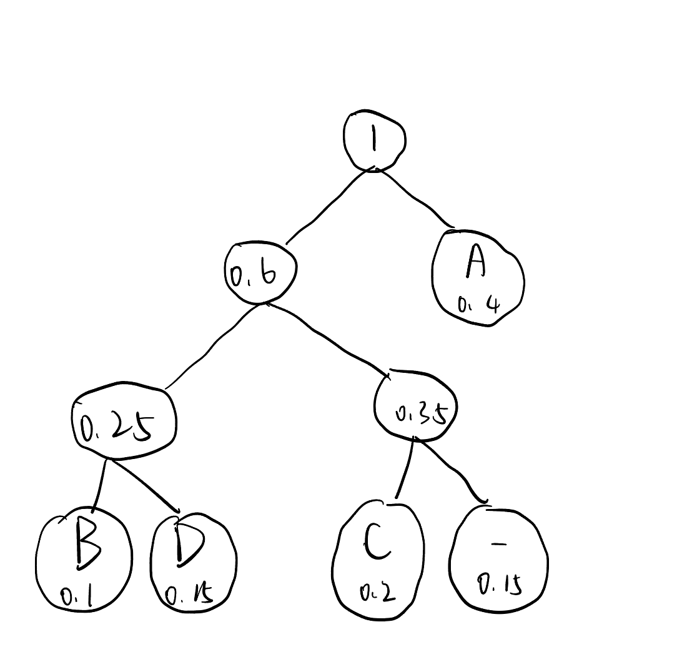

# 解答题

# 1.

先设棋盘尺寸为$n\times n$，求出通解后，再带入国际象棋棋盘实际尺寸$8\times 8$计算结果。

约定起点单元格为棋盘左上角$(1,1)$，行为第一个维度，列为第二个维度。

### 动态规划

定义二维数组$dp$，其中数组元素$dp[i][j](1≤i,j≤n)$表示车从起点$(1,1)$到达位置$(i,j)$最短路径的数量。

$dp$的元素间存在递归关系：$dp[i][j] = dp[i-1][j] + dp[i][j-1]$。

因为车到达位置$(i,j)$的最短路径数量等于其**从上方移动到该位置**和**从左侧移动到该位置**两种情况最短路径最大数量之和，所以这两种情况所对应的最短路径分别应为：

- $max(dp[k][j]),1≤k≤i-1$
- $max(dp[i][h]),1≤h≤j-1$

但由于二维数组每一行、每一列都存在递增关系，以上两项可以简化为$dp[i-1][j]$和$dp[i][j-1]$，即得到递推关系式。

初始化$dp$，$(1,1)$为0，车只需一步抵达所在行或列任意位置，因此第一行、第一列都初始化为1。

|      | 1    | 2    | 3    | ...  | n    |
| ---- | ---- | ---- | ---- | ---- | ---- |
| 1    | 0    | 1    | 1    | ...  | 1    |
| 2    | 1    |      |      | ...  |      |
| 3    | 1    |      |      | ...  |      |
| ...  | ...  | ...  | ...  | ...  | ...  |
| n    | 1    |      |      | ...  |      |

利用递推关系按照行优先填表，即顺序为$(2,2)\rightarrow (2,3)\rightarrow ... (2,n)\rightarrow (3,2)\rightarrow ...(n,n) $

对于国际象棋棋盘$n=8$的情况，填表结果如下：

|      | 1    | 2    | 3    | 4    | 5    | 6    | 7    | 8    |
| ---- | ---- | ---- | ---- | ---- | ---- | ---- | ---- | ---- |
| 1    | 0    | 1    | 1    | 1    | 1    | 1    | 1    | 1    |
| 2    | 1    | 2    | 3    | 4    | 5    | 6    | 7    | 8    |
| 3    | 1    | 3    | 6    | 10   | 15   | 21   | 28   | 36   |
| 4    | 1    | 4    | 10   | 20   | 35   | 56   | 84   | 120  |
| 5    | 1    | 5    | 15   | 35   | 70   | 126  | 210  | 330  |
| 6    | 1    | 6    | 21   | 56   | 126  | 252  | 462  | 792  |
| 7    | 1    | 7    | 28   | 84   | 210  | 462  | 924  | 1716 |
| 8    | 1    | 8    | 36   | 120  | 330  | 792  | 1716 | 3432 |

$dp$表格$(8,8)$的值即为结果3432。

### 基本排列组合

从$(1,1)$抵达$(n,n)$最短路径需要向右$n-1$步、向下$n-1$步。因此，将问题看成：在$2n-2$个步中，选出$n-1$步使之成为向右的步，则剩下的$n-1$步成为向下的步。

因此通解为：$\binom{n-1}{2n-2}$

对于国际象棋棋盘$n=8$的情况，计算$\binom{7}{14}=3432$。

# 2.

1. 一种可能的哈夫曼编码如下面的哈夫曼树所示：

规定向左为0，向右为1，则哈夫曼编码为：

- A : 1
- B : 000
- C : 010
- D : 001
- \-   : 011

2. 用上面编码对ABACABAD编码对结果为：1000101010001001
3. 用上面编码对100010111001010 解码结果为：ABA-ADC
